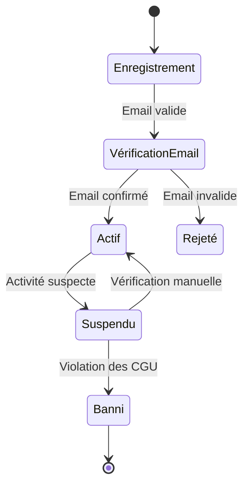
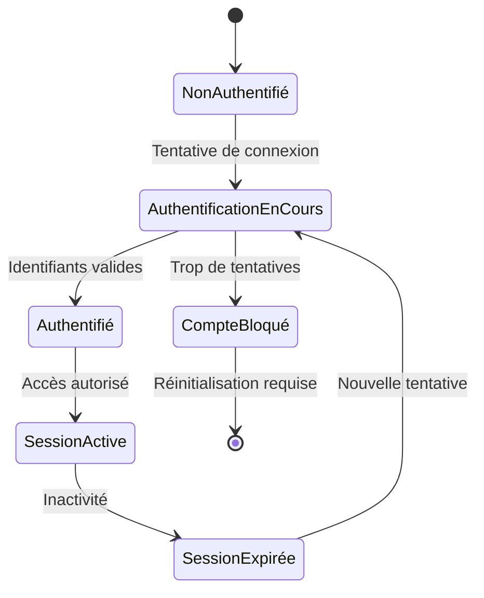

# Documentation du Module d'Authentification

## Structure des Fichiers

### 1. `auth.controller.ts`
**Rôle** : Gère les routes d'API liées à l'authentification.
- `POST /auth/register` : Enregistrement d'un nouvel utilisateur
- `POST /auth/login` : Connexion d'un utilisateur
- `GET /auth/me` : Récupération du profil utilisateur
- `POST /auth/sync` : Synchronisation avec un fournisseur d'identité externe (Kinde)

### 2. `auth.service.ts`
**Rôle** : Contient la logique métier de l'authentification.
- Gestion des mots de passe (hashage, vérification)
- Gestion des tokens JWT
- Synchronisation des utilisateurs
- Validation des identifiants

### 3. `auth.module.ts`
**Rôle** : Configuration du module d'authentification.
- Importe les dépendances nécessaires (JWT, Passport)
- Déclare les contrôleurs et services
- Configure la stratégie JWT

### 4. `strategies/jwt.strategy.ts`
**Rôle** : Implémente la stratégie d'authentification JWT.
- Vérifie la validité des tokens
- Extrait les informations utilisateur du token
- Vérifie les rôles et permissions

### 5. `dto/`
**Rôle** : Contient les objets de transfert de données.
- `login.dto.ts` : Structure des données de connexion
- `register.dto.ts` : Structure des données d'inscription
- `sync-user.dto.ts` : Structure pour la synchronisation utilisateur

### 6. `interfaces/`
**Rôle** : Définit les interfaces TypeScript.
- `auth.interface.ts` : Interfaces pour les réponses d'API et profils utilisateurs

## Scénarios d'Utilisation

### 1. Inscription d'un Nouvel Utilisateur
```typescript
// Requête POST /auth/register
{
  "email": "user@example.com",
  "password": "MotDePasse123!",
  "firstName": "Jean",
  "lastName": "Dupont"
}
```

### 2. Connexion
```typescript
// Requête POST /auth/login
{
  "email": "user@example.com",
  "password": "MotDePasse123!"
}

// Réponse
{
  "access_token": "eyJhbGciOiJIUzI1NiIsInR5cCI6IkpXVCJ9...",
  "user": {
    "id": "123e4567-e89b-12d3-a456-426614174000",
    "email": "user@example.com",
    "firstName": "Jean",
    "lastName": "Dupont",
    "isAdmin": false,
    "isCEO": false,
    "isClient": true
  }
}
```

### 3. Récupération du Profil
```typescript
// Requête GET /auth/me
// Header: Authorization: Bearer <token>

// Réponse
{
  "id": "123e4567-e89b-12d3-a456-426614174000",
  "email": "user@example.com",
  "firstName": "Jean",
  "lastName": "Dupont",
  "isAdmin": false,
  "isCEO": false,
  "isClient": true,
  "createdAt": "2025-11-02T09:00:00.000Z",
  "updatedAt": "2025-11-02T09:00:00.000Z"
}
```

## Transitions d'État

### 1. Flux d'Inscription


### 2. Flux d'Authentification


## Sécurité
- Mots de passe hashés avec bcrypt
- JWT signé avec une clé secrète
- Protection contre les attaques par force brute
- CORS configuré de manière sécurisée
- Headers de sécurité avec Helmet

## Journalisation
- Toutes les tentatives de connexion
- Échecs d'authentification
- Modifications de profil
- Activités suspectes

## Tests
1. Tests unitaires : `*.spec.ts`
2. Tests d'intégration : `*.e2e-spec.ts`
3. Tests de charge : Vérification des performances sous charge

## Dépendances
- @nestjs/jwt
- @nestjs/passport
- bcrypt
- passport-jwt
- @prisma/client
